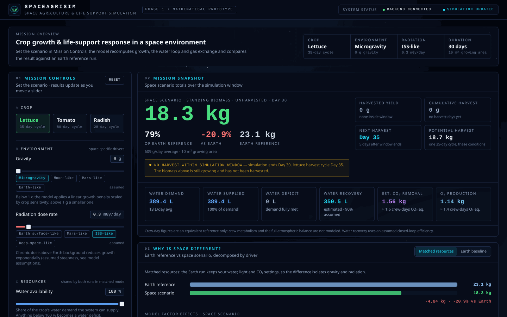
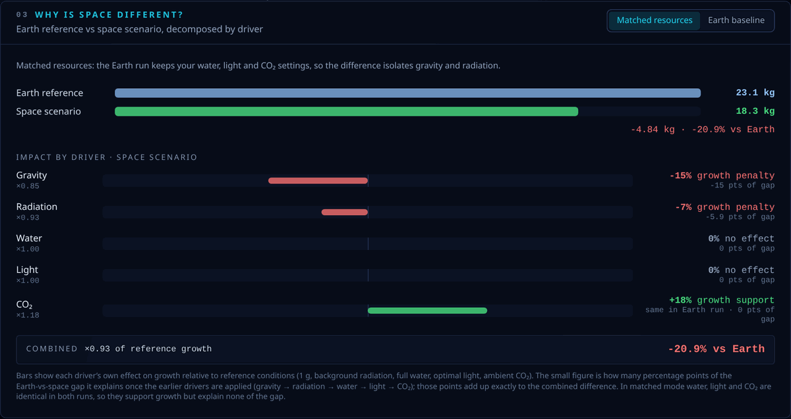
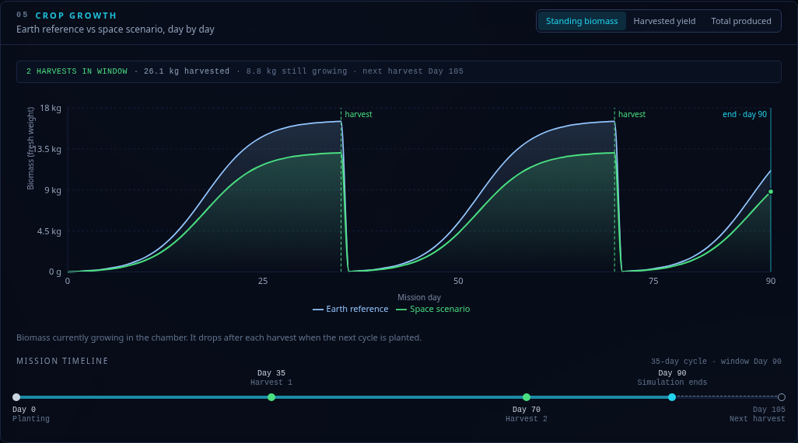
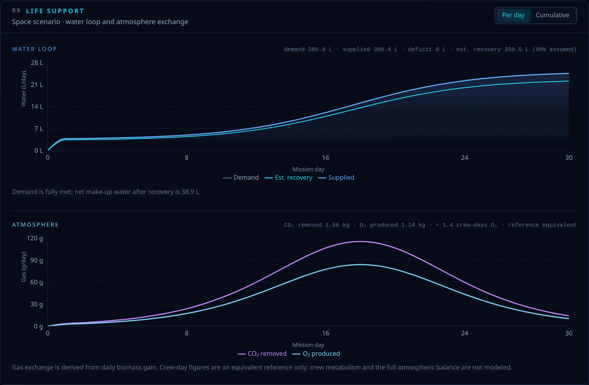
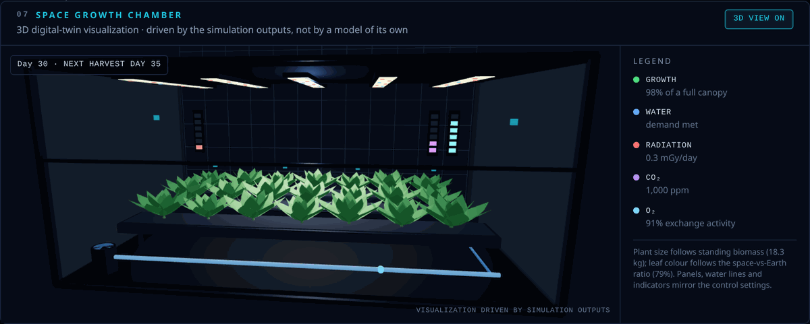
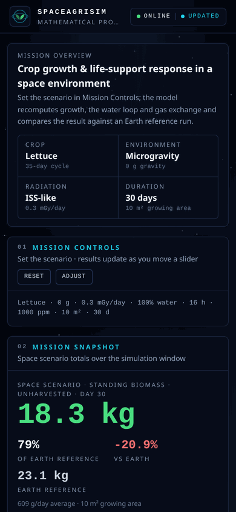

# SpaceAgriSim

**Space Agriculture & Life Support Simulation — Phase 1 · Mathematical prototype with a 3D digital‑twin visualization**

An interactive dashboard that models how space and environmental conditions
(gravity, radiation, water, light, CO₂) affect crop growth and the life‑support
metrics that come with it: water demand and deficit, water recovery, CO₂
removal and O₂ production. Pick a crop, drag a slider, and every number, chart
and the 3D growth chamber update immediately — for both an Earth reference and
your space scenario, with the difference broken down driver by driver.

| | |
| --- | --- |
| **What** | SpaceAgriSim — a space agriculture & life‑support simulator (NASA Space Apps Challenge project) |
| **Why** | Crops in a habitat are life‑support hardware: food, water recycling, CO₂ scrubbing and O₂ — mission planners need to see those trade‑offs together |
| **Current state** | Phase 1 · mathematical prototype, assumption‑driven and fully documented |
| **How** | Mission controls (crop, gravity, radiation, water, light, CO₂, area, duration) → FastAPI simulation engine → React dashboard |
| **Outputs** | Standing biomass · harvested yield · cumulative harvest · next / potential harvest · water demand / supplied / deficit / estimated recovery · CO₂ removed · O₂ produced · Earth‑vs‑space factor effects · generated mission insight |
| **Visualization** | 3D Space Growth Chamber (Three.js / React Three Fiber) driven purely by the simulation outputs, with a 2D fallback |
| **Limitation** | Not calibrated with or validated against NASA GeneLab / OSDR or experimental space‑crop data |
| **Future** | Phase 2 NASA open‑science calibration + climate / nutrient / crew‑balance modelling · Phase 3 ML / model fitting · Phase 4 full mission digital twin |

> **Phase 1 is a mathematical simulation prototype.**
> All numbers come from clearly documented simulation assumptions; nothing has
> been calibrated with or validated against NASA GeneLab / OSDR or other
> experimental data, and the project is not endorsed by NASA. Roadmap:
> Phase 2 — NASA GeneLab / OSDR data integration & calibration ·
> Phase 3 — ML / model fitting · Phase 4 — full mission digital twin.



| Why is space different? | Crop growth (90 days, 2 harvests) |
| --- | --- |
|  |  |

| Life support (water loop + atmosphere) | Space growth chamber (3D visualization) |
| --- | --- |
|  |  |

<details>
<summary>Mobile layout</summary>



</details>

---

## Table of contents

1. [What the project is](#1-what-the-project-is)
2. [Phase 1 scope](#2-phase-1-scope)
3. [What the simulator currently does](#3-what-the-simulator-currently-does)
4. [How the simulation works](#4-how-the-simulation-works)
5. [Current assumptions and limitations](#5-current-assumptions-and-limitations)
6. [Technology stack](#6-technology-stack)
7. [Project structure](#7-project-structure)
8. [Running the frontend](#8-running-the-frontend)
9. [Running the backend](#9-running-the-backend)
10. [Deploying to Vercel](#10-deploying-to-vercel)
11. [Example API request](#11-example-api-request)
12. [Future roadmap](#12-future-roadmap)

---

## 1. What the project is

Long term, SpaceAgriSim aims to become an interactive **Digital Twin for space
agriculture and life support** that combines NASA GeneLab / OSDR open‑science
data with mathematical models. Growing food in space is not just about
calories: plants also recycle water through transpiration, scrub CO₂ from the
cabin and release oxygen, so a crop module is a life‑support component.

Phase 1 proves the core loop: a parameter‑driven simulation engine behind a
clean API, and a dashboard that makes the trade‑offs visible in real time —
including a **3D digital‑twin visualization** of the growth chamber that is
driven purely by the simulation outputs. “Digital twin” describes where the
project is heading (Phase 4); the current model is a transparent, assumption‑
driven mathematical prototype, not a calibrated or validated mission twin.

## 2. Phase 1 scope

**In scope**

- A transparent, parameter‑driven simulation engine (Python)
- REST API (`POST /api/simulate`, `GET /api/crops`, `GET /api/config`,
  `GET /api/assumptions`)
- A single‑page mission‑control dashboard: grouped mission controls, mission
  snapshot, Earth‑vs‑space impact breakdown, generated mission insight and
  what‑if comparison, growth and life‑support charts, mission timeline
- A 3D **Space Growth Chamber** digital‑twin view (Three.js / React Three
  Fiber): transparent chamber, crop trays, instanced plants, grow lights, water
  manifold, monitoring points and radiation / CO₂ / O₂ indicators, all driven
  by the simulation outputs — on by default where WebGL and the device allow,
  lazy‑loaded, with a 3D VIEW ON/OFF switch and a 2D schematic fallback
- Explicit separation of **standing biomass**, **harvested yield**,
  **cumulative harvest**, **next harvest** and **potential harvest**
- Water loop semantics: **demand / supplied / deficit / estimated recovery**
- Model assumptions and model status reported by the backend itself
- Input validation, error handling, responsive layout, keyboard access
- Unit + API tests for the engine

**Explicitly out of scope (later phases)**

- NASA GeneLab / OSDR integration or dataset downloads
- Machine learning, model training, AI prediction
- Authentication, user accounts, databases
- Real‑time NASA data or any claim of NASA validation

## 3. What the simulator currently does

| Control | Range | Default |
| --- | --- | --- |
| Crop | Lettuce · Tomato · Radish | Lettuce |
| Gravity | 0 – 2 g (scenarios: Microgravity, Moon‑like, Mars‑like, Earth‑like) | 0 g |
| Radiation | 0 – 3 mGy/day (scenarios: Earth surface‑like, Mars‑like, ISS‑like, Deep‑space‑like) | 0.3 |
| Water availability | 0 – 100 % | 100 % |
| Light | 0 – 24 h/day | 16 h |
| CO₂ level | 300 – 3000 ppm | 1000 ppm |
| Growing area | 0.1 – 100 m² | 10 m² |
| Simulation duration | 7 · 14 · 30 · 60 · 90 days | 30 days |

Scenario presets are rounded Phase 1 reference points (hence the “‑like”
labels), not measured mission data — the UI says so in a tooltip.

For every change the dashboard shows, top to bottom:

1. **Mission overview** — CROP / ENVIRONMENT / RADIATION / DURATION summary.
2. **Mission snapshot** — the primary biomass figure with its Earth ratio
   (e.g. `18.3 kg standing biomass · unharvested · Day 30 · 79 % of Earth
   reference · −20.9 %`), then **harvested yield**, **cumulative harvest**,
   **next harvest (day)** and **potential harvest**, then the metric cards:
   water demand / supplied / deficit / recovery (estimated), CO₂ removed and
   estimated O₂ produced, each with its crew‑day *reference equivalent*.
3. **Why is space different?** — Earth‑reference vs space‑scenario bars of
   the **total biomass produced** in the window (standing + harvested; with
   the default 30‑day lettuce run that is all standing biomass and 0 g
   harvested), the signed difference in grams and %, the comparison mode
   (matched resources / Earth baseline) and a per‑driver **model factor
   effects** waterfall (gravity, radiation, water, light, CO₂ → combined) —
   assumed Phase 1 response curves, not measured values.
4. **Mission insight** — a summary sentence generated from the outputs, plus a
   *what changed?* table: pin the current scenario as a baseline, change one
   parameter, and see the biomass / O₂ / CO₂ / water‑deficit deltas.
5. **Crop growth** — Earth and space **standing biomass** over the simulated
   days, switchable to **harvested yield** (steps up at each harvest) or
   **total produced** (standing + harvested), with harvest markers when a run
   spans one or more crop cycles, an end‑of‑window marker, and a mission
   timeline (planting → harvests → simulation end → next harvest).
6. **Life support** — a **water loop** chart (demand / supplied / deficit /
   recovered) and a separate **atmosphere** chart (CO₂ removed / O₂ produced),
   per day or cumulative, each on a single axis.
7. **Space growth chamber** — the 3D digital‑twin view (3D VIEW ON/OFF).
   Plant size follows standing biomass, leaf colour follows the space‑vs‑Earth
   ratio, the water manifold turns amber in deficit, the radiation strip warns
   at high dose and the CO₂ / O₂ strips follow the setting and the gas exchange.
8. **Model assumptions** — collapsible formulas and constants, an
   **Assumed in Phase 1** / **Not modelled yet** summary (not modelled yet:
   temperature, relative humidity, nutrients, atmospheric pressure, human
   metabolism, the full atmospheric balance and crew‑level closed‑loop life
   support — planned Phase 2 extensions), and the **model status** block
   (Phase 1 · mathematical prototype · not NASA‑ or experimentally validated ·
   Phase 2 roadmap).

Example behaviour (defaults, lettuce, 30 days, 10 m²):

```
Earth: 23.1 kg   Space: 18.3 kg   Difference: -20.9 %
Gravity ×0.85 −15 % penalty · Radiation ×0.93 −7 % penalty · Water ×1.00 · Light ×1.00 ·
CO₂ ×1.18 +18 % support (same in the Earth run, so 0 pts of the gap) → combined −20.9 %
Harvest: NO HARVEST WITHIN SIMULATION WINDOW — simulation ends Day 30, lettuce harvest cycle Day 35
```

Raising radiation lowers growth, biomass, CO₂ removal and O₂; cutting water
availability by 5 % lowers the modelled water factor (and so biomass) by 5 %,
reduces supplied and recovered water accordingly, and turns the missing 5 % of
demand into a reported water deficit — the demand itself does not change.

### Biomass vs harvest — how to read the numbers

| Term | Meaning |
| --- | --- |
| **Standing biomass** (`harvest.standingBiomass`) | Edible biomass growing in the chamber at the end of the window, not yet harvested |
| **Harvested yield** (`harvest.lastHarvestYield`) | Biomass of the most recent completed harvest (0 if no cycle finished) |
| **Cumulative harvest** (`harvest.harvestedYield`) | All harvests inside the window added up — note the API field name is `harvestedYield` |
| **Total biomass produced** (`cropYield`) | Standing + cumulative harvest |
| **Next harvest** (`harvest.nextHarvestDay`) | First harvest day after the window ends |
| **Potential harvest** (`harvest.potentialHarvest`) | Estimated biomass one full cycle would deliver at harvest under the current conditions — a model projection, not harvested output |

A 30‑day lettuce run has 18.3 kg of standing biomass and **0 g harvested**,
because the 35‑day cycle is not finished. The dashboard never presents
unharvested biomass as a harvest.

### Water loop — how to read the numbers

| Term | Meaning |
| --- | --- |
| **Demand** | What a healthy canopy would want (grows with the canopy and the photoperiod) |
| **Supplied** | What the system actually delivers = demand × availability (`waterUsed` in the API carries this value) |
| **Deficit** | Unmet demand = demand − supplied; the shortage already limits growth through the water factor |
| **Water recovery (estimated)** | Supplied × 90 % assumed closed‑loop recovery efficiency — a model assumption, not a measured value |
| **Net consumed** | Supplied − recovered = fresh make‑up water |

CO₂ / O₂ crew‑day figures are an *equivalent reference only*; crew metabolism
and the full atmospheric balance are not modelled.

## 4. How the simulation works

Everything numerical lives in `backend/app/simulation/`, and every constant in
`backend/app/config/simulation_constants.py`. The UI contains no formulas.

### 4.1 Environment factors (`factors.py`)

Each input maps to a dimensionless multiplier where **1.0 = Earth reference**:

| Factor | Shape | Notes |
| --- | --- | --- |
| Gravity | linear penalty from 1 g down to 0 g (−15 % at 0 g × crop sensitivity), small penalty above 1 g | |
| Radiation | `exp(−k · sensitivity · (dose − background))` | k = 0.25 per mGy/day |
| Water | `(availability / 100) ^ 1.0` | linear |
| Light | saturating `h / (h + 10)` normalised to the crop's optimal photoperiod, mild penalty past the optimum | 24 h light is *not* better than 16 h |
| CO₂ | saturating `c / (c + 150)` normalised to 420 ppm | ≈ +18 % at 1000 ppm |

```
growthFactor = lightFactor × waterFactor × gravityFactor × radiationFactor × co2Factor
```

### 4.2 Growth (`growth.py`)

Biomass follows a logistic (S‑shaped) curve across the crop cycle, scaled by
the growth factor and the growing area:

```
biomass(day) = harvestBiomass × growthFactor × area × logistic(day / cycleLength)
```

If the run is longer than one cycle the crop is harvested and replanted.
Each daily point carries the **standing biomass** (growing in the chamber,
unharvested), the **harvested yield** so far (whole cycles only) and the
**total produced** (standing + harvested), plus a harvest‑day flag; the engine
also reports the harvest days, the **next harvest** day and the **potential
harvest** of one full cycle under the current conditions. A window shorter
than the cycle (the default 30‑day lettuce run) therefore ends with 18.3 kg of
standing biomass, **0 g harvested yield** and no completed harvest.

### 4.3 Water (`water.py`)

Daily **demand** is what a healthy canopy would want: it follows the canopy
(a seedling transpires ~15 % of a full canopy) and scales with the light
factor. Lower water availability does **not** lower that biological demand —
it lowers what is **supplied**, and the gap is reported as the **deficit**:

```
canopy         = 0.15 + 0.85 × growthFraction
demand(day)    = peakWaterPerDay × area × lightFactor × canopy   # crop / environment requirement
supplied(day)  = demand(day) × waterAvailability / 100           # share of demand actually delivered
deficit(day)   = demand(day) − supplied(day)                     # unmet demand
recovered(day) = supplied(day) × recoveryEfficiency              # estimated; recoveryEfficiency = 0.90 (assumed)
```

The dashboard shows these as **water demand / water supplied / water deficit /
water recovery (estimated, 90 % assumed)**. In the API the supplied volume is
carried by the `waterUsed` field (kept for compatibility).

### 4.4 CO₂ and O₂ (`gas_exchange.py`)

Gas exchange is derived from the biomass actually gained each day, so it stays
consistent with growth:

```
dryMassGain = (edibleGain / harvestIndex) × dryMatterFraction
carbonFixed = dryMassGain × 0.42
co2Removed  = carbonFixed × 44/12
o2Produced  = co2Removed × 32/44          # 6 CO2 + 6 H2O -> C6H12O6 + 6 O2
```

### 4.5 Earth vs space (`engine.py`)

The engine runs the pipeline twice — once for the space scenario and once for
an Earth reference run — and the dashboard offers two different Earth runs:

| | Matched resources (default) | Earth baseline |
| --- | --- | --- |
| Gravity | 1 g | 1 g |
| Radiation | 0.01 mGy/day (background) | 0.01 mGy/day (background) |
| Water availability | same as your space scenario | 100 % |
| Photoperiod | same as your space scenario | the crop's optimum |
| CO₂ | same as your space scenario | 420 ppm (ambient) |
| Crop · area · duration | same | same |
| What it isolates | the modelled effect of gravity and radiation alone | a normalised Earth reference, so your resource settings show up in the gap too |

The two Earth runs are therefore different numbers whenever your water, light
or CO₂ differ from the reference values (with the defaults only CO₂ does:
23.1 kg matched vs 19.6 kg baseline). The mode in use is always shown in the
panel and returned as `comparison.earthComparisonMode`.

```
spaceGrowthPercentage = 100 × spaceBiomass / earthBiomass     # total biomass produced in the window
differencePercent     = spaceGrowthPercentage − 100
```

Both runs use the same crop, area, window and logistic curve, and growth is
linear in the combined factor, so the ratio is simply the two combined factors
divided. With the defaults the space run sits at ×0.93 of *reference* growth
(gravity ×0.85 · radiation ×0.93 · CO₂ ×1.18) while the matched‑resources
Earth run keeps the same CO₂ and sits at ×1.18 — hence 0.93 / 1.18 = 0.79,
i.e. 79 % of Earth or −20.9 %. In Earth‑baseline mode the Earth run is ×1.00,
so the same space scenario reads 93 % of Earth (−6.7 %) — a different question,
not a different model. The "×0.93 of reference growth" and "79 % of Earth reference"
figures on the dashboard are therefore two views of the same number, not a
discrepancy; the panel prints the division explicitly.

When the Earth reference produces nothing (e.g. 0 % water) the comparison is
flagged `isDefined: false` instead of showing a meaningless −100 %.

### 4.6 Impact breakdown (`impact.py`)

Because growth is linear in the combined factor and the combined factor is a
product, the space/Earth ratio is the product of per‑driver ratios. The engine
unpacks it into a waterfall: start at 100 %, apply gravity → radiation → water
→ light → CO₂ one at a time and record how many percentage points each step
adds or removes. The contributions add up exactly to the combined difference.
In *matched* mode the resources are identical in both runs, so they contribute
0 points; their absolute response (e.g. CO₂ +18 %) is still reported as
`responsePercent`.

### 4.7 Crop baselines (assumptions, per m²)

| Crop | Cycle | Edible biomass | Peak water | Optimal light | Radiation / µg sensitivity |
| --- | --- | --- | --- | --- | --- |
| Lettuce | 35 d | 2000 g | 2.5 L/day | 16 h | 1.0 / 1.0 |
| Tomato | 80 d | 3500 g | 4.5 L/day | 16 h | 1.2 / 1.2 |
| Radish | 28 d | 1200 g | 2.0 L/day | 14 h | 0.9 / 0.9 |

## 5. Current assumptions and limitations

- All constants are **rounded order‑of‑magnitude assumptions** chosen so the
  prototype behaves sensibly. They are not measured values and not NASA data.
- Factors are multiplied independently; real interactions (e.g. light × CO₂)
  are ignored.
- The gravity penalty is a placeholder; real microgravity effects on biomass
  are modest and mixed in the literature.
- Radiation response is a simple exponential in dose rate; dose type, LET and
  acute vs chronic exposure are not modelled.
- Water recovery uses a fixed 90 % efficiency; no tank sizing or system losses.
- O₂/CO₂ follow textbook stoichiometry with a fixed carbon fraction; respiration
  and root‑zone gas exchange are not modelled. The crew‑day figures on the
  dashboard are a reference scale only.
- **Not modelled in Phase 1** (planned model extensions, not missing features):
  temperature, relative humidity, nutrients, atmospheric pressure, plant stress,
  human metabolism (crew O₂ consumption and CO₂ production), the full
  atmospheric balance, and crew‑level closed‑loop life support. Phase 1 reports
  what the crop produces and consumes; it does not balance that against a crew.
- The 3D growth chamber is a visualisation of the simulation outputs only; it
  has no physics or model of its own.
- Nothing here has been validated against experimental space‑grown crop data;
  Phase 1 is a mathematical prototype, not an experimentally or NASA‑validated
  model.

## 6. Technology stack

| Layer | Tech |
| --- | --- |
| Frontend | React 19, Vite 7, Tailwind CSS 4, Recharts 3, Three.js + React Three Fiber (lazy‑loaded 3D view) |
| Backend | Python 3.11+, FastAPI, Pydantic v2, Uvicorn |
| Tests | pytest (engine + API) |
| Tooling | npm, pip, Git |

## 7. Project structure

```
SpaceAgriSim/
├── frontend/
│   ├── index.html
│   ├── vite.config.js          # dev server + /api proxy to FastAPI
│   └── src/
│       ├── App.jsx
│       ├── main.jsx
│       ├── pages/DashboardPage.jsx
│       ├── components/         # MissionHeader, SystemStatus, MissionOverview, MissionControls,
│       │                       # ScenarioSelector, MetricSummary, EarthSpaceComparison, ImpactBreakdown,
│       │                       # MissionInsight, GrowthPanel, MissionTimeline, LifeSupportPanel,
│       │                       # DigitalTwin3D, ModelAssumptions, SystemAlert, Panel, ...
│       ├── charts/             # GrowthChart, LifeSupportChart (water loop + atmosphere), chartTheme
│       ├── three/              # GrowthChamberScene (react-three-fiber, lazy-loaded)
│       ├── hooks/              # useSimulation, useSimulationParams, useSimulationConfig
│       ├── services/           # simulationApi, formatters, validation, defaultConfig, insights, twinState
│       └── styles/index.css    # Tailwind + design tokens
├── backend/
│   ├── requirements.txt        # runtime dependencies
│   ├── requirements-dev.txt    # + pytest / httpx
│   ├── .python-version         # 3.12 (used by Vercel)
│   ├── app/
│   │   ├── main.py             # FastAPI app
│   │   ├── routes/             # health, simulation, error handlers
│   │   ├── models/             # Pydantic request/response schemas
│   │   ├── simulation/         # crops, factors, growth, water, gas_exchange, impact, engine,
│   │   │                       # model_description, serializers
│   │   └── config/             # settings + simulation_constants (all assumptions)
│   └── tests/                  # pytest suite
├── docs/screenshots/           # dashboard captures used in this README
├── vercel.json                 # Vercel deployment: web + api services, /api/* → FastAPI
├── .gitignore
├── LICENSE
└── README.md
```

## 8. Running the frontend

Requires Node 18+.

```bash
cd frontend
npm install
npm run dev          # http://localhost:5173
```

The dev server proxies `/api/*` to `http://127.0.0.1:8000`, so start the
backend too. To point at a different backend, copy `.env.example` to
`.env.local` and set `VITE_BACKEND_URL`.

Production build: `npm run build` (output in `frontend/dist/`).
Lint: `npm run lint`.

## 9. Running the backend

Requires Python 3.11+.

```bash
cd backend
python -m venv .venv
source .venv/bin/activate        # Windows: .venv\Scripts\activate
pip install -r requirements-dev.txt   # runtime deps + pytest/httpx
uvicorn app.main:app --reload --port 8000
```

- Interactive docs: http://localhost:8000/api/docs
- Health check: http://localhost:8000/api/health
- Tests: `pytest`

`requirements.txt` holds only what the API needs at runtime (this is what a
deployment installs); `requirements-dev.txt` adds the test tooling.

No secrets or credentials are needed. Optional settings (CORS origins) can be
set through environment variables, see `backend/.env.example`.

## 10. Deploying to Vercel

The repository is set up to deploy as **one Vercel project** with two
services (`vercel.json`):

| Service | Root | What Vercel does |
| --- | --- | --- |
| `web` | `frontend/` | `npm install` + `vite build`, served from the CDN |
| `api` | `backend/` | installs `requirements.txt`, runs `app.main:app` as a Python 3.12 function |

Requests to `/api/*` are routed to the FastAPI service, everything else to the
built frontend — same origin, so no CORS or backend URL configuration is
needed (the frontend already calls the relative path `/api`).

Steps:

1. Push the repository to GitHub (already the case).
2. In Vercel: **Add New → Project → Import** `meherabmehu/SpaceAgriSim`.
3. Leave **Root Directory** at the repository root (`./`) — `vercel.json`
   must be picked up from there. Do not set a framework preset, build command
   or output directory in the dashboard; the services in `vercel.json` carry
   their own.
4. No environment variables are required. Click **Deploy**.
5. Verify on the deployment URL: `/` (dashboard), `/api/health`,
   `/api/config`, `/api/docs` (Swagger UI).

After that every push to `main` produces a production deployment and every
other branch a preview URL. Vercel Services is currently in beta; if you prefer
two separate projects instead, deploy `backend/` as a FastAPI project and
`frontend/` as a Vite project, then either add a `frontend/vercel.json` rewrite
from `/api/(.*)` to the backend URL or set `SPACEAGRISIM_CORS_ORIGINS` on the
backend to the frontend origin.

## 11. Example API request

```bash
curl -X POST http://localhost:8000/api/simulate \
  -H "Content-Type: application/json" \
  -d '{
    "crop": "lettuce",
    "gravity": 0.0,
    "radiation": 0.3,
    "waterAvailability": 100,
    "lightHours": 16,
    "co2Level": 1000,
    "simulationDays": 30,
    "growingArea": 10,
    "earthComparisonMode": "matched"
  }'
```

Abridged response:

```json
{
  "cropYield": 18268.5,
  "growthRate": 608.95,
  "waterUsed": 389.4,
  "waterRecovered": 350.46,
  "co2Removed": 1563.0,
  "estimatedOxygenProduced": 1136.7,
  "spaceGrowthPercentage": 79.1,
  "crop": { "key": "lettuce", "name": "Lettuce", "growthDurationDays": 35, "cyclesCompleted": 0 },
  "space": {
    "cropYield": 18268.5,
    "factors": { "light": 1.0, "water": 1.0, "gravity": 0.85, "radiation": 0.9301, "co2": 1.1801, "combined": 0.933 }
  },
  "earth": { "cropYield": 23108.4, "...": "..." },
  "comparison": {
    "earthYield": 23108.4,
    "spaceYield": 18268.5,
    "differenceGrams": -4839.9,
    "differencePercent": -20.9,
    "spaceGrowthPercentage": 79.1,
    "earthComparisonMode": "matched",
    "isDefined": true,
    "impact": {
      "factors": [
        { "key": "gravity", "percent": -15.0, "responsePercent": -15.0, "contributionPoints": -15.0, "runningPercent": 85.0 },
        { "key": "radiation", "percent": -7.0, "contributionPoints": -5.9, "runningPercent": 79.1 },
        { "key": "co2", "percent": 0.0, "responsePercent": 18.0, "contributionPoints": 0.0, "runningPercent": 79.1 }
      ],
      "combinedPercent": -20.9, "limitingFactor": "gravity", "boostingFactor": null
    }
  },
  "harvest": {
    "standingBiomass": 18268.5, "harvestedYield": 0.0, "lastHarvestYield": 0.0, "lastHarvestDay": null,
    "cumulativeBiomass": 18268.5, "potentialHarvest": 18659.1,
    "cycleLengthDays": 35, "cyclesCompleted": 0, "harvestDays": [],
    "nextHarvestDay": 35, "daysUntilNextHarvest": 5, "harvestWithinWindow": false, "simulationDays": 30
  },
  "lifeSupport": {
    "crewO2DaysSupported": 1.35, "crewCo2DaysRemoved": 1.56, "waterRecoveryEfficiency": 0.9,
    "water": { "demand": 389.4, "supplied": 389.4, "deficit": 0.0, "recovered": 350.46, "netConsumed": 38.94, "recoveryEfficiency": 0.9, "deficitPercent": 0.0 }
  },
  "dailyGrowthData": [
    { "day": 1, "cycle": 1, "earthBiomass": 52.5, "spaceBiomass": 41.5, "earthCumulative": 52.5, "spaceCumulative": 41.5,
      "earthHarvested": 0.0, "spaceHarvested": 0.0, "isHarvestDay": false, "dayInCycle": 1, "growthFraction": 0.0022 }
  ],
  "dailyWaterData": [ { "day": 1, "waterUsed": 3.797, "waterRecovered": 3.418, "waterDemand": 3.797, "waterDeficit": 0.0, "cumulativeWaterUsed": 3.8, "cumulativeWaterRecovered": 3.42, "cumulativeWaterDemand": 3.8, "cumulativeWaterDeficit": 0.0 } ],
  "dailyLifeSupportData": [ { "day": 1, "waterUsed": 3.797, "waterRecovered": 3.418, "waterDemand": 3.797, "waterDeficit": 0.0, "co2Removed": 3.55, "o2Produced": 2.58, "cumulativeCo2Removed": 3.5, "cumulativeO2Produced": 2.6 } ],
  "disclaimer": "Phase 1 mathematical prototype. Outputs are based on documented simulation assumptions, not on validated NASA data or predictions."
}
```

Units: biomass / CO₂ / O₂ in grams, water in litres, growth rate in g/day.
Out‑of‑range inputs return `422` with a flat `message` and a per‑field map.

All fields from the first version of the API are still present with the same
names and meaning — `cropYield` (total biomass produced), `growthRate`,
`waterUsed` (= water supplied), `waterRecovered`, `co2Removed`,
`estimatedOxygenProduced`, `spaceGrowthPercentage` — the harvest,
water‑balance (`waterDemand`, `waterDeficit`, `lifeSupport.water`) and impact
blocks were added on top. The dashboard's user‑facing labels (standing
biomass, water supplied, water recovery) describe these fields; the field
names themselves are unchanged.

Other endpoints: `GET /api/crops` (baseline parameters), `GET /api/config`
(ranges, defaults, scenario presets, model assumptions and model status — the
UI builds its controls and the assumptions panel from this),
`GET /api/assumptions`, `GET /api/health`.

### Testing

```bash
cd backend && pytest            # engine, impact breakdown, harvest/water bookkeeping, API
cd frontend && npm run lint     # ESLint
cd frontend && npm run build    # production build (3D scene is a separate lazy chunk)
```

## 12. Future roadmap

**Phase 1 → Phase 2 boundary.** Phase 1 (this release) is a transparent
mathematical prototype built on documented assumptions. Phase 2 is the NASA
open‑science‑informed calibration and expansion of the environmental and
life‑support modelling. Everything listed below is planned work — none of it is
implemented in the Phase 1 simulator.

- **Phase 2 — NASA open‑science calibration & model expansion**
  - *Calibration*: replace the constants in `simulation_constants.py` with
    values derived from NASA GeneLab / OSDR and other public research; the
    engine is built so only that file (or a data loader producing
    `CropProfile` objects) needs to change.
  - *Climate and Nutrients Controls* (planned module):
    - **Temperature** — develop a temperature‑dependent growth‑penalty curve.
    - **Relative humidity** — model humidity / transpiration effects,
      particularly under microgravity.
    - **Nutrients** — model continuous hydroponic nutrient delivery and
      fertilizer depletion over the crop cycle.
    - **Pressure** — investigate atmospheric‑pressure effects as a future
      environmental factor.
  - *Crew‑atmosphere balance* (planned), next to the existing crop‑side CO₂
    removed / O₂ produced:
    - human metabolic O₂ consumption;
    - human CO₂ production;
    - full atmospheric balance;
    - closed‑loop crop + crew life‑support modelling.

    Future versions can combine crop O₂ production and CO₂ removal with crew
    metabolic demand to estimate farm area requirements for closed‑loop crew
    support. Such figures need a properly defined crew‑demand and closed‑loop
    methodology first, so Phase 1 deliberately does not report them.
  - *Resources*: climate, nutrient and crew‑balance modelling should be
    informed by NASA's Advanced Plant Habitat and other controlled‑environment
    plant‑growth resources, together with appropriate NASA open‑science data.
    These resources are intended for future calibration and model
    development; none of them has been integrated yet.
- **Phase 3 — ML / model fitting**: fit response curves / ML models on the
  calibrated data, expose uncertainty bands in the charts.
- **Phase 4 — full mission digital twin**: grow the current 3D chamber
  visualization into multi‑crop modules, crew demand balancing, scenario saving
  and mission‑level planning (Moon / Mars transit / surface).
- Also planned: more crops, scenario export and sharing.

Phase 2 candidates, for reference: temperature · relative humidity · nutrients
· pressure · climate controls · hydroponic nutrient depletion · human metabolic
demand · full atmospheric balance · closed‑loop crew + crop life‑support
analysis.

---

Phase 1 is a mathematical simulation prototype. It is not validated against
NASA or experimental data and is not endorsed by NASA. NASA GeneLab / OSDR data
integration (Phase 2), ML / model fitting (Phase 3) and a full mission digital
twin (Phase 4) are planned for later phases.

Licensed under the [MIT License](LICENSE).
